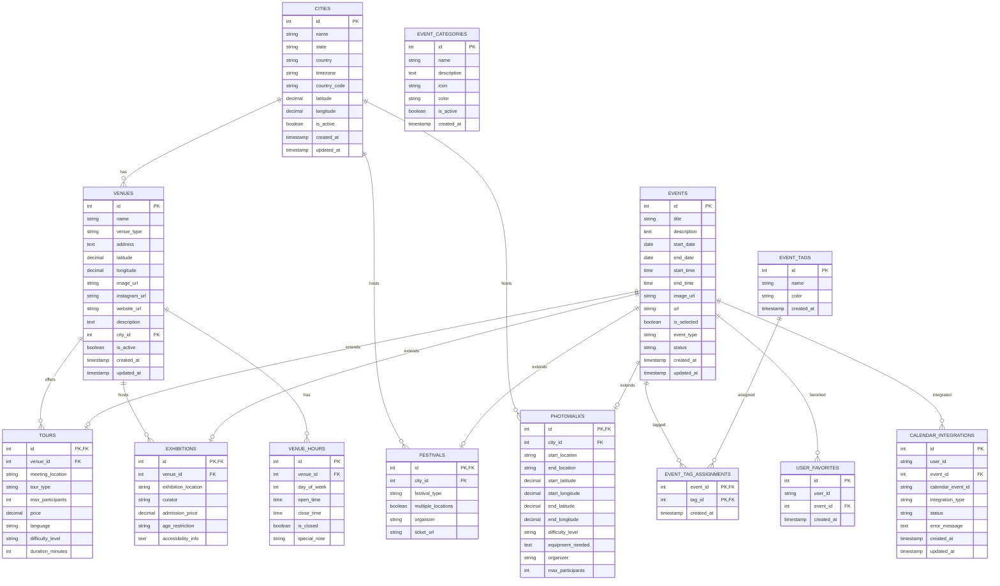

# Database Schema Visualization

## Entity Relationship Diagram



## Key Design Features

### 1. Polymorphic Inheritance
- **Events Table**: Base table for all event types
- **Specialized Tables**: Tours, Exhibitions, Festivals, Photowalks
- **Single Table Inheritance**: Efficient queries across event types

### 2. Geographic Support
- **Cities**: Full geographic data with timezone support
- **Venues**: Precise location coordinates
- **Photowalks**: Start/end location tracking

### 3. Flexible Relationships
- **Venues**: Can host multiple event types
- **Cities**: Can host city-wide events (festivals, photowalks)
- **Tags**: Many-to-many relationship for flexible categorization

### 4. User Features
- **Favorites**: User-specific event preferences
- **Calendar Integration**: Track external calendar sync status
- **Session Support**: Works with or without user accounts

### 5. Performance Optimizations
- **Strategic Indexes**: On frequently queried columns
- **Composite Indexes**: For multi-column queries
- **Soft Deletes**: Maintain data integrity

## Index Strategy

### Primary Indexes
```sql
-- Cities
CREATE INDEX idx_cities_country ON cities(country);
CREATE INDEX idx_cities_timezone ON cities(timezone);
CREATE INDEX idx_cities_active ON cities(is_active);

-- Venues
CREATE INDEX idx_venues_city ON venues(city_id);
CREATE INDEX idx_venues_type ON venues(venue_type);
CREATE INDEX idx_venues_location ON venues(latitude, longitude);

-- Events
CREATE INDEX idx_events_type ON events(event_type);
CREATE INDEX idx_events_dates ON events(start_date, end_date);
CREATE INDEX idx_events_status ON events(status);
CREATE INDEX idx_events_selected ON events(is_selected);

-- Tours
CREATE INDEX idx_tours_venue ON tours(venue_id);
CREATE INDEX idx_tours_type ON tours(tour_type);
CREATE INDEX idx_tours_language ON tours(language);

-- User Features
CREATE INDEX idx_favorites_user ON user_favorites(user_id);
CREATE INDEX idx_calendar_user ON calendar_integrations(user_id);
```

### Composite Indexes
```sql
-- Event filtering
CREATE INDEX idx_events_city_type ON events(city_id, event_type, start_date);
CREATE INDEX idx_events_date_range ON events(start_date, end_date, status);

-- Venue operations
CREATE INDEX idx_venues_city_type ON venues(city_id, venue_type, is_active);
```

## Data Flow

### 1. Event Creation
1. Create base event record
2. Create specific event type record
3. Link to venue/city
4. Add tags and categories
5. Update indexes

### 2. Event Querying
1. Filter by city and date range
2. Join with event type tables
3. Include venue information
4. Apply user preferences
5. Return paginated results

### 3. User Interactions
1. Track favorites
2. Sync with external calendars
3. Maintain user session data
4. Log user preferences

This schema provides a solid foundation for a scalable event management system with proper normalization, performance optimization, and user features.
